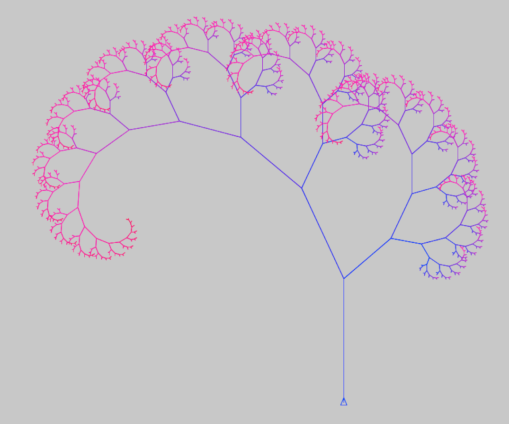
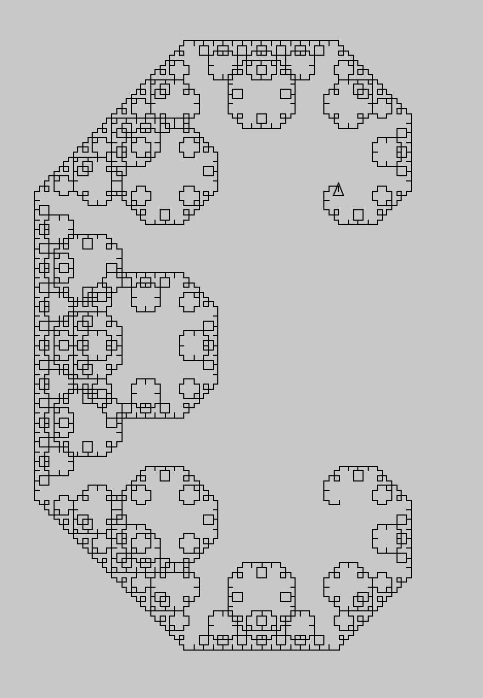
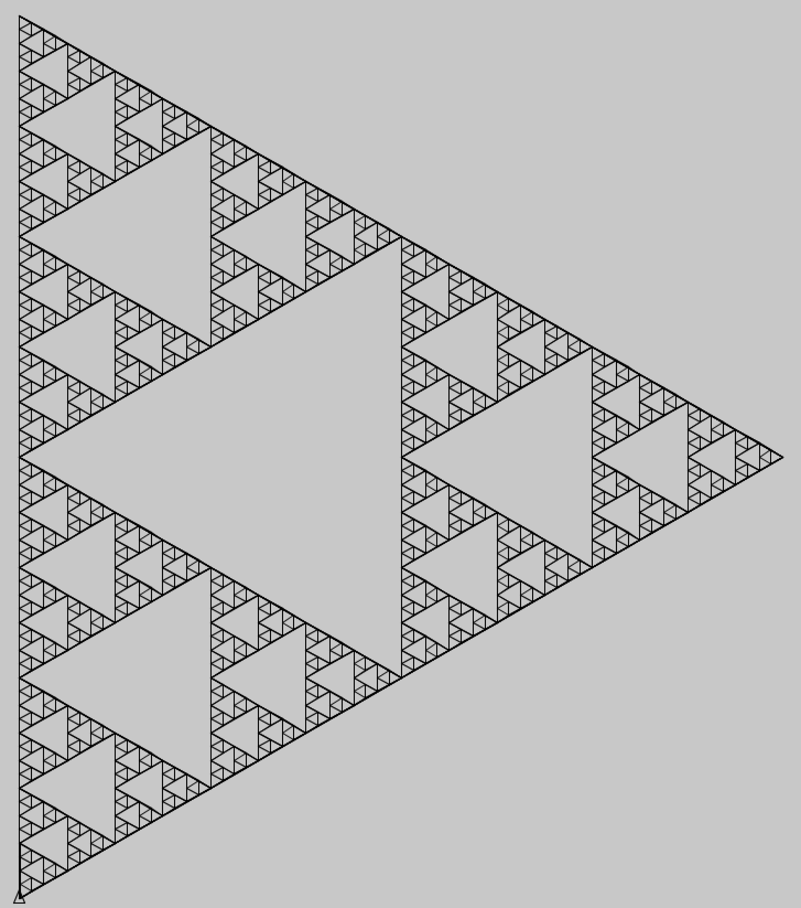

# clojturtle

Clojure turtle fractal examples

## tree

## c curve

## sierpinski

## Usage

`lein repl`
`(new-window {:size [920 900]})`

### tree
`(setxy 100 -200)`

`(tree/tree [0 100 100] 5 200 true)`

### Lévy C curve
`(setxy -100 -200)`

`(cline 8 300)`

### Sierpiński
`(setxy -400 -400)`

`(sierpi 15 800)`

## License

Copyright © 2019 Henna Kalliokoski

This program and the accompanying materials are made available under the
terms of the Eclipse Public License 2.0 which is available at
http://www.eclipse.org/legal/epl-2.0.

This Source Code may also be made available under the following Secondary
Licenses when the conditions for such availability set forth in the Eclipse
Public License, v. 2.0 are satisfied: GNU General Public License as published by
the Free Software Foundation, either version 2 of the License, or (at your
option) any later version, with the GNU Classpath Exception which is available
at https://www.gnu.org/software/classpath/license.html.
