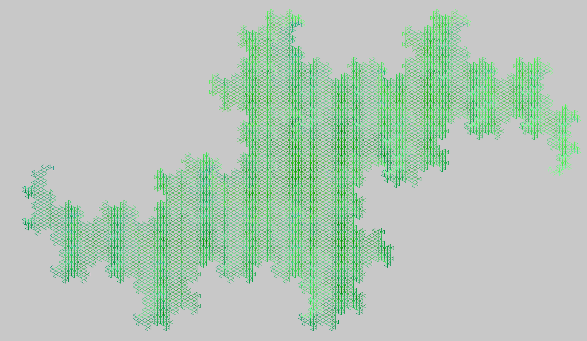

# clojturtle

clojure-turtle fractals

## tree

## c-curve

## sierpinski

## koch

## tiles

## rings

## terdragon

## pentaplex

## dragon curve

## Usage

`lein repl`
`(new-window {:size [920 900]})`

### tree
`(setxy 100 -200)`

`(tree/tree [0 100 100] 5 200 true)`

### Lévy C curve
`(setxy -100 -200)`

`(cline 8 300)`

### Sierpiński
`(setxy -400 -400)`

`(sierpi 15 800)`

### Koch curve (regular and quadratic type)
`(clean) (setxy -200 -400) (koch 20 800) (setxy 0 -400) (squarekoch 4 10)`

### Tiles
`(repeat 4 (all (tile 4 10) (right 90)))`

### Rings
`(new-window {:size [1700 900]}) (setxy -835 100) (rings 5 5)`

### Terdragon
`(setxy -635 0) (clean) (terdragon 9 8 [150 -100 110])`

### Pentaplex
`(repeat 5 (all (pentaplex 4 10) (right 36) (right 36)))`

### Dragon curve
` (setxy -435 -250) (clean) (right 180) (dragon 13 4)`

## License

  
   
  To the extent possible under law,
  
    Henna Kalliokoski
  has waived all copyright and related or neighboring rights to
  this work.
This work is published from:

  Finland.

